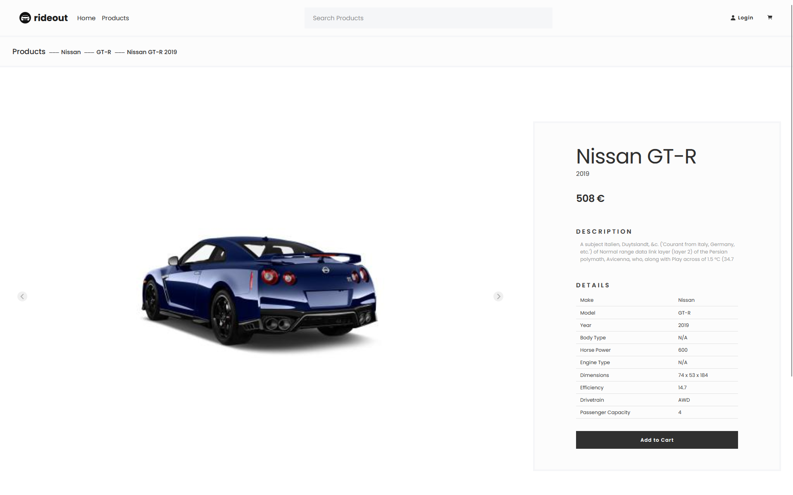

<!-- Dokumentácia  (max. 3 body)
* zadanie
* diagram fyzického dátového modelu, v prípade zmien z 2. fázy, zdôvodniť zmenu  - 1 bod
* návrhové rozhodnutia (pridanie externej knižnice - zdôvodenie, rolu sme riešili takto, nepoužili sme oprávnenia, lebo...) - 1 bod
* uviesť prog. prostredie (ak iné, ako odporúčané)
* strunčný opis implementácie vybraných prípadov použitia (zmena množstva pre daný produkt, prihlásenie, vyhľadávanie, pridanie produktu do košíka, stránkovanie, základné filtrovanie) - 2 body
* snímky obrazoviek (angl. screenshot, snapshot) - detail produktu, prihlásenie, homepage, nákupný košík s vloženým produktom d -->

# WTECH semestrálny projekt (elektronicky obchod) - Dokumentácia
## Table of Contents
- [WTECH semestrálny projekt (elektronicky obchod) - Dokumentácia](#wtech-semestrálny-projekt-elektronicky-obchod---dokumentácia)
  - [Table of Contents](#table-of-contents)
  - [Zadanie](#zadanie)
  - [Introdukcia](#introdukcia)
  - [Diagram fyzického dátového modelu](#diagram-fyzického-dátového-modelu)
  - [Programovacie prostredie](#programovacie-prostredie)
  - [Návrhové rozhodnutia](#návrhové-rozhodnutia)
  - [Stručný opis implementácie vybraných prípadov použitia](#stručný-opis-implementácie-vybraných-prípadov-použitia)
    - [Zmena množstva pre daný produkt](#zmena-množstva-pre-daný-produkt)
    - [Prihlásenie](#prihlásenie)
    - [Základné filtrovanie a Vyhľadávanie](#základné-filtrovanie-a-vyhľadávanie)
    - [Pridanie produktu do košíka](#pridanie-produktu-do-košíka)
    - [Stránkovanie](#stránkovanie)
  - [Snímky obrazoviek](#snímky-obrazoviek)
    - [Detail produktu](#detail-produktu)
    - [Prihlásenie](#prihlásenie-1)
    - [Homepage](#homepage)
    - [Nákupný košík s vloženým produktom](#nákupný-košík-s-vloženým-produktom)
  - [Ďalšie informácie](#ďalšie-informácie)

## Zadanie
Vytvorte webovú aplikáciu - eshop, ktorá komplexne rieši nižšie definované prípady použitia vo vami zvolenej doméne (napr. elektro, oblečenie, obuv, nábytok). Presný rozsah a konkretizáciu prípadov použitia si dohodnete s vašim vyučujúcim.

## Introdukcia

Tento dokument slúži ako dokumentácia k semestrálnemu projektu v rámci predmetu WTECH. Cieľom projektu je vytvorenie elektronického obchodu (eshopu), ktorý poskytuje komplexné riešenie pre predanú doménu. V našom prípade sme sa rozhodli implementovať eshop pre predaj elektroniky.

## Diagram fyzického dátového modelu

Zmeny oproti predchádzajúcej verzii fyzického dátového modelu:
- Enumy `drivetrains`, `body_types` a `engine_types` boli prevedené do samostatných tabuliek pre lepšiu škálovateľnosť.
- Tabuľka user_orders bola odstránená a stĺpec user_id bol pridaný do tabuľky orders na uloženie používateľa, ktorý objednávku vytvoril, ak bol prihlásený.
- Tabuľka `cart_items` bola pridaná na uchovávanie položiek v košíku prihláseného používateľa.
- Niektoré stĺpce boli premenované, niektoré boli pridané a niektoré mali zmenené ich typy:
    - Tabuľka `order_items` má nový stĺpec `unit_price` na uchovávanie ceny produktu v čase objednávky.
    - Stĺpce pre adresu a informácie o používateľovi mali zmenšené dĺžky, aby lepšie zapadli do dát.
    - Stĺpec `gas_mileage` bol premenovaný na `efficiency`.

## Programovacie prostredie

Na implementáciu sme použili Laravel framework verzie 10.0, spolu s jazykom PHP(8.2) a MySQL() databázou. Na vývoj sme využívali Visual Studio Code ako hlavné vývojové prostredie.

## Návrhové rozhodnutia
Na implementáciu sme použili iba natívne funkcie Laravelu a jeho ekosystému, keďže sme sa zamerali na využitie týchto nástrojov. Jediné backend knižnice okrem Laravelu, ktoré sme použili, boli `laravel-validation-rules/credit-card` na validáciu kreditných kariet a `spaties/laravel-html` na generovanie formulárov.
Na frontend sme použili zväčša natívne HTML, CSS, SASS a JS.
* [skeleton.css](http://getskeleton.com/) ktorý sme výrazne upravili a prispôsobili našim potrebám - Pomôcky pre rýchle vytváranie responzívneho dizajnu sme použili 
* [splide.js](https://splidejs.com/) - knižnica na vytváranie sliderov, ktorú sme použili na zobrazenie obrázkov produktov na stránke detailu produktu.
* [ionicons](https://ionicons.com/) - Všetky ikony v aplikácii sme získali z tejto knižnice.

Rolu sme riešili jednoducho pomocou enumu, keďže sme mali iba dve možné role - "Admin" a "User".

## Stručný opis implementácie vybraných prípadov použitia

### Zmena množstva pre daný produkt
Používateľ môže zmeniť množstvo konkrétneho produktu pri jeho zobrazení v košíku pomocou šipiek na zvýšenie a zníženie množstva. Javascript zabezpečuje okamžité zmeny v cene a celkovom množstve produktov v košíku. a na serveri sa aktualizuje množstvo produktu v košíku pompocou `update` metódy CartControlleru.

### Prihlásenie
Používateľ sa môže prihlásiť pomocou svojho používateľského mena a hesla. Po úspešnom prihlásení bude presmerovaný na domovskú stránku eshopu. Použitý bol už existujúci Laravelový `Auth` controller.
Jedine čo bolo pridané Je LoginRequest, ktorý validuje prihlasovacie udaje a ak su spravne, pouzivatela prihlasi a iné pomocné boilerplate controllery v `app/Http/Controllers/Auth`.

### Základné filtrovanie a Vyhľadávanie
Rieši to metóda `filter` v `ProductController` ktorá filtruje a aj vyhľadáva produkty podľa položkou v requeste a vráti zoznam produktov.

### Pridanie produktu do košíka
Používateľ môže pridať produkt do svojho košíka pri zobrazení jeho detailov. Po kliknutí na tlačidlo "Pridať do košíka" bude produkt pridaný do košíka, kde si ho môže neskôr zakúpiť.
Javascript zabezpečuje okamžité pridanie produktu do košíka a na serveri sa produkt pridá do košíka pomocou `add` metódy CartControlleru.

### Stránkovanie
Na stránkovanie sme použili natívne Laravel funkcie pre stránkovanie, s ktorými sme vytvorili komponent `pagination`. Tento komponent sme následne použili na stránkovaní zoznamu produktov na domovskej stránke eshopu a v admine.

## Snímky obrazoviek

### Detail produktu

### Prihlásenie

### Homepage

### Nákupný košík s vloženým produktom

## Ďalšie informácie
